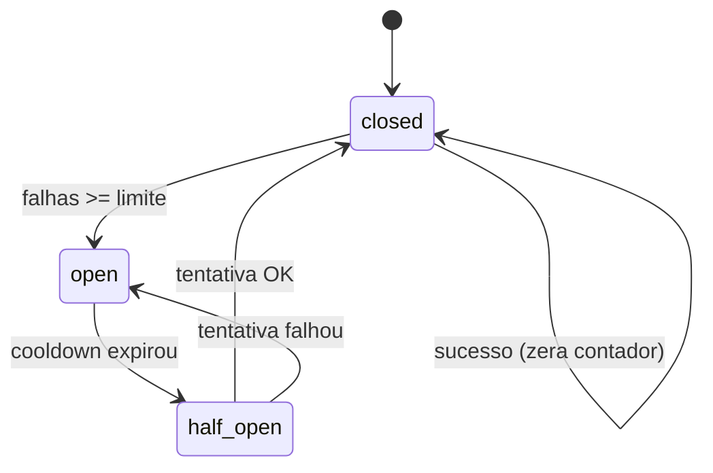

# Circuit Breaker + Backoff

## O que é Circuit Breaker

Padrão inspirado no **disjuntor elétrico**: quando uma dependência externa (API da transportadora) falha de forma repetida, o sistema **para de insistir** por um tempo e responde rápido com erro controlado, em vez de empilhar timeouts e filas.

Estados típicos:

| Estado | Comportamento |
|--------|----------------|
| **Fechado (closed)** | Chamadas normais; falhas são contadas. |
| **Aberto (open)** | Chamadas bloqueadas de imediato (fail-fast); nada bate na API externa. |
| **Meio-aberto (half-open)** | Após um cooldown, **uma** tentativa de prova; sucesso fecha de novo, falha reabre. |

Objetivo: **proteger** o ShipSync e dar **tempo** para a transportadora se recuperar, sem martelar o mesmo endpoint durante um incidente.

## O que é Backoff com Jitter

**Backoff** = esperar antes de tentar de novo após uma falha **transitória** (timeout, 502, rede instável). No ShipSync usamos backoff **exponencial**: 1ª espera curta, 2ª maior, 3ª maior ainda, até um teto (`backoff_max_ms`).

**Jitter** = um **atraso aleatório** somado a cada espera (até ~25% do delay calculado). Sem jitter, muitos workers falham no mesmo instante e **retentam juntos** (*thundering herd*), piorando pico de carga. Com jitter, os retries se espalham no tempo.

Exemplo simplificado (base 100 ms, jitter 0 para ilustrar só a exponência):

| Tentativa após falha | Espera aproximada |
|----------------------|-------------------|
| 1 | 100 ms |
| 2 | 200 ms |
| 3 | 400 ms |

Na prática cada valor ganha jitter aleatório antes do `sleep`.

Circuit breaker e backoff **complementam**: backoff trata falhas **pontuais** na mesma operação; o breaker reage a **padrão** de falhas entre várias operações e corta chamadas quando a integração está degradada.

## Por que usamos isso

- Transportadoras caem ou ficam lentas; retries cegos amplificam incidentes e esgotam workers.
- Circuit breaker **falha rápido** quando a integração está instável, dando tempo de recuperação.
- Backoff exponencial com **jitter** espalha retries e evita thundering herd.

## Como aparece no ShipSync

`ResilientCarrierQuoteAdapter` decora `CarrierQuotePort` (stub hoje, HTTP depois): retries só em `RetryableCarrierFailure` (ex.: `CarrierTransportException`), estado do breaker em cache compartilhado (`CacheCircuitBreakerStateStore`, ex. Redis). Config em [`config/shipping.php`](../../../config/shipping.php).

## Erros comuns e causa raiz

| Sintoma | Causa raiz |
|---------|------------|
| Breaker nunca abre entre requests | `SHIPPING_RESILIENCE_ENABLED=false` ou cache não compartilhado (driver `array` fora de testes) |
| 503 imediato sem chamar carrier | Breaker aberto — cooldown ou falhas anteriores no mesmo `circuit_key` |
| Retry em erro 422 da API | Exceção não implementa `RetryableCarrierFailure` — correto; mapear só falhas transitórias |
