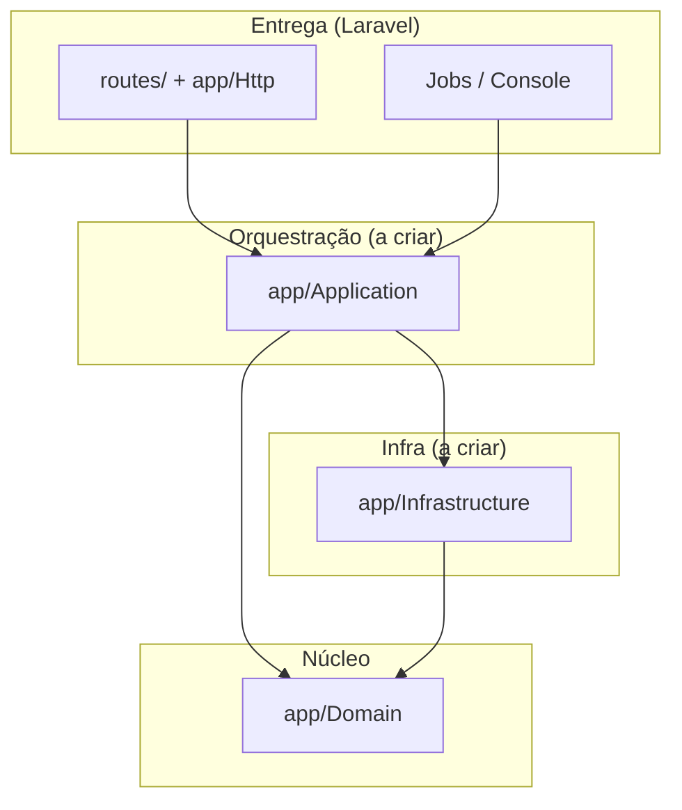

# Arquitetura de pastas — ShipSync Hub

Guia para **onde colocar código e documentação** no repositório. Complementa o roadmap em [`desenvolvimento.md`](desenvolvimento.md) e o setup em [`setup.md`](setup.md).

---

## Visão em camadas (aplicação)

O projeto segue **Clean Architecture**: regras de negócio no centro; Laravel, AWS e HTTP ficam nas bordas.



| Camada | Pasta | Responsabilidade | Estado hoje |
|--------|--------|------------------|-------------|
| Domínio | `app/Domain/` | VOs, entidades, exceções, **ports** (interfaces) | `Shipping/` com cotação |
| Aplicação | `app/Application/` | Casos de uso, orquestração, DTOs de entrada/saída | `Messaging/` (port de fila) |
| Infraestrutura | `app/Infrastructure/` | Adapters: SQS, DynamoDB, S3, HTTP de transportadoras | `Aws/` (SQS + DynamoDB) |
| Entrega Laravel | `app/Http/`, `routes/` | Controllers finos, validação HTTP, resposta JSON | Bootstrap Laravel |
| Framework | `app/Models/`, `app/Providers/` | Internals Laravel (User, providers) | Padrão Laravel |

**Regra prática:** nada em `app/Domain` importa SDK AWS, Guzzle ou Facades Laravel. Fronteiras externas expõem interface (port); implementação fica em `Infrastructure`.

---

## Árvore do repositório (raiz)

```
shipsync_hub/
├── app/                    # Código PHP da aplicação (camadas acima)
├── bootstrap/              # Boot do Laravel
├── config/                 # Config (env → config/*; AWS em services.php)
├── database/               # Migrations/seeders Laravel (SQLite interno)
├── docker/                 # Dockerfile do serviço app (PHP 8.4)
├── docs/                   # Documentação para humanos
├── localstack/             # Init scripts (SQS, DLQ, S3, DynamoDB)
├── public/                 # Front controller (index.php)
├── resources/              # Views/assets Laravel
├── routes/                 # web.php, console.php
├── storage/                # Cache/logs/sessions de runtime (gitignored em parte)
├── tests/                  # Pest: Domain, Feature, Infrastructure, Unit
├── bin/                    # Atalhos: composer, test e serve (API + Swagger) via Docker
├── .cursor/                # Skills, hooks e docs do co-piloto
├── docker-compose.yml      # Redis, Memcached, LocalStack, app (profile dev)
├── composer.json           # PHP 8.4+, Laravel 11, Pest 3
├── phpunit.xml             # Suites de teste + env de hosts
├── .env.example            # Modelo de ambiente (nunca commitar .env)
└── p-1.md                  # Prompt inicial do projeto (referência histórica)
```

Pastas geradas localmente e **não versionadas** (ver [`.gitignore`](../.gitignore)): `vendor/`, caches em `storage/`, `.env`.

---

## `app/` — detalhe

### `app/Domain/Shipping/` (implementado)

Módulo de **cotação de frete** — primeiro vertical slice de domínio.

| Caminho | Conteúdo |
|---------|----------|
| `Cep.php`, `Money.php`, `Weight.php`, `Dimensions.php`, `Package.php` | Value objects e validações |
| `QuoteRequest.php`, `Quote.php`, `QuoteResult.php` | Pedido e resultado de cotação |
| `CarrierQuotePort.php` | Contrato: cotação em transportadora externa |
| `QuoteRepositoryPort.php` | Contrato: persistir/recuperar resultado |
| `Exceptions/` | Erros de domínio (`InvalidCep`, `InvalidQuoteRequest`, etc.) |

Novos bounded contexts podem aparecer como `app/Domain/<Contexto>/` (ex.: rastreio, etiquetas), sempre com a mesma regra de isolamento.

### `app/Http/` e `routes/`

Controllers **finos**: validar request, chamar caso de uso (`Application`), mapear resposta. Sem regra de frete inline.

### Pastas alvo (próximas fases)

```
app/Application/Shipping/     # ex.: RequestQuoteUseCase
app/Infrastructure/Aws/       # SQS, DynamoDB, S3 (config via services.aws)
app/Infrastructure/Carriers/  # Adapters que implementam CarrierQuotePort
```

---

## `tests/` — espelho da arquitetura

| Pasta | Boot Laravel? | O que testa |
|-------|---------------|-------------|
| `tests/Domain/` | Não | Regras puras (`tests/Domain/Shipping/*`) |
| `tests/Infrastructure/` | Não | Saúde Redis, Memcached, LocalStack |
| `tests/Feature/` | Sim | HTTP, integração com framework |
| `tests/Unit/` | PHPUnit puro | Placeholder / unitários genéricos |

Configuração: [`tests/Pest.php`](../tests/Pest.php) estende `TestCase` **só** em `Feature/`. Comandos: [`setup.md`](setup.md) e `./bin/test`.

---

## Infra local e AWS simulada

| Caminho | Papel |
|---------|--------|
| [`docker-compose.yml`](../docker-compose.yml) | Redis (sessão/fila), Memcached (cache cotação), LocalStack, container `app` |
| [`localstack/init/ready.d/`](../localstack/init/ready.d/) | Cria fila `shipsync-jobs`, DLQ, bucket `shipsync-local`, tabela DynamoDB |
| [`config/services.php`](../config/services.php) | Bloco `aws`: endpoint, bucket, fila, tabela — **único lugar** para ler credenciais/endpoints no código |
| [`.env.example`](../.env.example) | `AWS_ENDPOINT`, `REDIS_*`, `MEMCACHED_*`, drivers Laravel |

Persistência de **negócio** → DynamoDB (não MySQL no compose). SQLite em `database/` serve apenas internals Laravel.

---

## Documentação: duas pastas

| Onde | Público | Exemplos |
|------|---------|----------|
| [`docs/`](.) | Desenvolvedores humanos | `setup.md`, `desenvolvimento.md`, **este arquivo** |
| [`.cursor/docs/`](../.cursor/docs/README.md) | Co-piloto / aprendizado rápido | redis, localstack, ports, pest-tdd |

Conceito técnico novo (Strategy, Adapter, DLQ) → pasta em `.cursor/docs/<topico>/README.md`. Mudança de roadmap ou fase concluída → [`desenvolvimento.md`](desenvolvimento.md).

---

## Automação Cursor (`.cursor/`)

| Caminho | Papel |
|---------|--------|
| `.cursor/skills/shipsync-*` | Regras persistentes (TDD, AWS, arquitetura, status) |
| `.cursor/hooks/` | Validação de commit, lembrete de infra, sync do roadmap |
| `.cursor/docs/` | Notas de conceito (ver tabela acima) |

Não é runtime da aplicação; não deployar nem importar no PHP de produção.

---

## Onde colocar código novo (checklist)

1. **Regra de negócio de frete/cotação** → `app/Domain/Shipping/` (+ teste em `tests/Domain/Shipping/`).
2. **Orquestrar ports (várias transportadoras, persistir)** → `app/Application/` (quando existir).
3. **Chamar SQS, DynamoDB, API Correios/Jadlog** → `app/Infrastructure/` implementando o port correspondente.
4. **Endpoint REST ou comando Artisan** → `routes/` + controller/comando fino → caso de uso.
5. **Só validar Docker/LocalStack** → `tests/Infrastructure/`.
6. **Variável de ambiente nova** → `.env.example` + `config/*.php` (evitar `env()` espalhado fora de `config/`).

---

## Referências

- Roadmap e fases: [`desenvolvimento.md`](desenvolvimento.md)
- Operacional: [`setup.md`](setup.md)
- Clean Architecture (nota curta): [`.cursor/docs/clean-architecture/`](../.cursor/docs/clean-architecture/README.md)
- Ports de cotação: [`.cursor/docs/ports/`](../.cursor/docs/ports/README.md)
